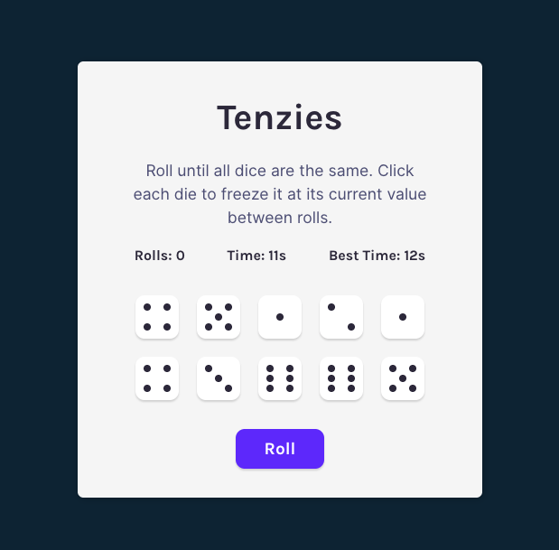
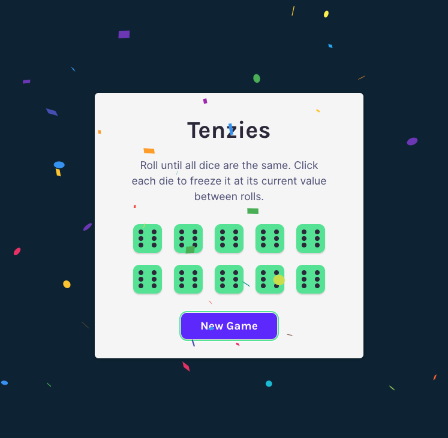

# Tenzies Game

A simple and fast React implementation of the classic Tenzies game.
This project uses lazy initialization, accessible focus states, and smooth UX with confetti animations on win.

🌐 [Live site on Netlify](https://tenziesbyana.netlify.app/)

## Features

- Tenzies gameplay with interactive, clickable dice
- Tracks the **number of rolls** per game
- Timer counts **seconds elapsed** during gameplay
- Records and displays **best time** across sessions using `localStorage`
- Lazy state initialization for improved performance
- Confetti animation on win (`react-confetti`)
- Accessible focus management and screen-reader announcements
- Installable as a PWA (Progressive Web App)

## Tools Used

- React
- Vite
- [react-confetti](https://www.npmjs.com/package/react-confetti)
- [nanoid](https://github.com/ai/nanoid#readme)
- [Biome](https://biomejs.dev/) for linting and formatting

## How to Play

1. Click **Roll** to roll the dice.
2. Click any die to **hold** its number.
3. Continue rolling until **all dice show the same value**.
4. When you win, a confetti animation appears.
    - Your **time and rolls** are recorded; try to beat your best time!
5. Click **New Game** to reset the board.

## 🚀 Performance

Optimized for maximum efficiency, scoring a perfect **100** in all Lighthouse categories (Performance, Accessibility,
Best Practices, and SEO).

## 📸 Screenshot

  
  

